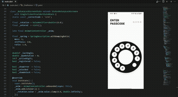

# ☎️ Rotary Dial Lock Screen — Flutter

A classic rotary phone dial reimagined as a mobile lock screen.
Built entirely in **Flutter** with **zero external packages** — pure Dart from scratch.

## Demo



---

## Features

- **Custom-drawn dial** via `CustomPainter` — no images, pure Canvas
- **Real spring-back physics** using `SpringSimulation` from `flutter/physics`
- **High-performance rendering** — only the Canvas repaints on each frame, not the full widget tree
- **Natural gesture tracking** with angular delta via `atan2()`
- **Digit registered during drag** — exactly like a real rotary phone
- **Error state** — dots turn red on wrong passcode with haptic feedback
- **Two-stage unlock animation** — "Lock" → "Unlock System" with fade + scale transition

---

## Project Structure

```
lib/
├── main.dart                                      # Entry point & system UI setup
└── feature/
    └── rotary_lock/
        ├── constants.dart                         # Colors, angles & dial config
        └── presentation/
            ├── pages/
            │   └── rotary_lock_screen.dart        # Main screen & gesture logic
            └── widgets/
                ├── dial_painter.dart              # CustomPainter for the rotating dial
                └── passcode_dots.dart             # Passcode indicator dots row
```

---

## How It Works

| Concept | Implementation |
|---|---|
| Drawing the dial | `CustomPainter` + `Canvas` with `save/rotate/restore` |
| Gesture tracking | `GestureDetector` + `atan2()` for angular delta |
| Performance | `ValueNotifier` + `ValueListenableBuilder` — only Canvas repaints |
| Spring-back | `AnimationController.unbounded` + `SpringSimulation` |
| Digit registration | During drag when hole reaches within 20° of the stop |
| Unlock animation | `AnimatedSwitcher` with `FadeTransition` + `ScaleTransition` |

---

## Getting Started

```bash
flutter pub get
flutter run
```

Default passcode: **`1234`**

---

## Built With

- `dart:math` — `atan2`, `cos`, `sin`, `pi`
- `flutter/material.dart` — widgets & painting
- `flutter/physics.dart` — `SpringSimulation`, `SpringDescription`
- `flutter/services.dart` — `HapticFeedback`, `SystemChrome`
- **Zero external packages**

---

## Inspired By

Original concept by **Kyriakos Georgiopoulos** — originally built in Kotlin/Compose.
